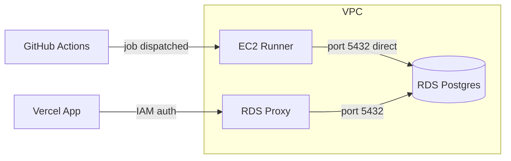

# M1-15: Self-hosted GHA Runner in VPC for Database Migrations

## Problem

The RDS Proxy enforces `iam_auth = "REQUIRED"`, which rejects the password-based connections that `prisma migrate deploy` needs (running as `lumigraph_admin` with a Secrets Manager password). The DB instance sits in a VPC with its security group only allowing ingress from the proxy SG. A self-hosted runner inside the VPC can reach the DB instance directly on its private endpoint.

## Architecture




- Runner connects directly to the RDS **instance** endpoint (not proxy) using the master password from Secrets Manager
- Proxy remains IAM-only for runtime app traffic from Vercel
- DB security group gains a second ingress rule: runner SG on port 5432

## Design Decision: Runner in Bootstrap

The runner is **Tier 0 / CI infrastructure** -- it is the thing that runs pipelines for the app stack. Placing it in `infrastructure/bootstrap`:

- **Eliminates the chicken-and-egg problem**: apply bootstrap locally once, runner registers, all future app and migrate workflows run on it
- **Matches the existing pattern**: bootstrap already owns OIDC provider, state bucket, IAM roles -- all CI plumbing
- **Isolates blast radius**: destroying/recreating the app stack does not kill the CI runner
- **Cross-stack reference is minimal**: app only needs one new variable (`runner_security_group_id`) and one ingress rule

## Scope Breakdown

### 1. Bootstrap Terraform -- runner resources (I write this)

Add to [infrastructure/bootstrap/main.tf](infrastructure/bootstrap/main.tf):

- `data "aws_vpc" "default"` and `data "aws_subnets" "default_vpc"` -- resolve default VPC/subnets (same pattern as app stack)
- `data "aws_ssm_parameter" "al2023_ami"` -- latest Amazon Linux 2023 x86_64 AMI
- `aws_security_group.runner` -- egress-only (no inbound), same VPC as RDS
- `aws_iam_role.runner` -- EC2 assume role
- `aws_iam_instance_profile.runner`
- `aws_iam_policy.runner` -- Secrets Manager read (`rds!`*), KMS decrypt, `rds:DescribeDBInstances`, SSM Session Manager (`ssmmessages:`*, `ec2messages:*`, `ssm:UpdateInstanceInformation`)
- `aws_instance.gha_runner` -- `t3.micro`, Amazon Linux 2023, user data from template, in default VPC subnet

Create [infrastructure/bootstrap/templates/runner-user-data.sh](infrastructure/bootstrap/templates/runner-user-data.sh):

- Install dependencies (`jq`, `libicu`, `dotnet` deps)
- Fetch GitHub PAT from Secrets Manager
- Call GitHub API to get a registration token
- Download runner agent (latest v2.331.0)
- `./config.sh --url ... --token ... --labels lumigraph-runner-{env} --unattended --replace` (label includes env so workflows can target the right runner per environment)
- Install and start as systemd service (`./svc.sh install && ./svc.sh start`)
- Install Node.js 20 + pnpm (needed for `prisma migrate deploy`)

Add to [infrastructure/bootstrap/variables.tf](infrastructure/bootstrap/variables.tf):

- `runner_instance_type` (default `"t3.micro"`)
- `runner_pat_secret_name` (default `"lumigraph/github-runner-pat"`)
- `vpc_id` (default `null` -- uses default VPC)
- `subnet_ids` (default `[]` -- uses default VPC subnets)

Add to [infrastructure/bootstrap/outputs.tf](infrastructure/bootstrap/outputs.tf):

- `runner_instance_id`
- `runner_security_group_id`

### 2. App Terraform -- DB SG ingress (I write this)

Add to [infrastructure/app/variables.tf](infrastructure/app/variables.tf):

- `runner_security_group_id` (string, default `""`)

Add to [infrastructure/app/main.tf](infrastructure/app/main.tf):

- `aws_vpc_security_group_ingress_rule.db_from_runner` -- conditional on `var.runner_security_group_id != ""`, allows port 5432 from runner SG into `aws_security_group.db`

### 3. Migrate workflow update (I write this)

Update [.github/workflows/migrate.yml](.github/workflows/migrate.yml):

- Split into two jobs: `validate` (PRs, on `ubuntu-latest`) and `migrate` (non-PR, on `[self-hosted, lumigraph-runner-{env}]`)
- Runner label is environment-specific: `lumigraph-runner-dev` or `lumigraph-runner-prod`
- The migrate job uses `db_instance_endpoint` (direct RDS, not proxy) in the `DATABASE_URL`
- The validate job stays on `ubuntu-latest` (no DB access needed)

### 4. Bootstrap IAM -- GHA role permissions (I write this)

Add to the `github_actions_permissions` policy in [infrastructure/bootstrap/main.tf](infrastructure/bootstrap/main.tf):

- EC2 instance management: `ec2:RunInstances`, `ec2:TerminateInstances`, `ec2:DescribeInstances`, `ec2:DescribeImages`, `ec2:DescribeInstanceTypes`, `ec2:DescribeInstanceAttribute`
- IAM instance profile: `iam:CreateInstanceProfile`, `iam:DeleteInstanceProfile`, `iam:GetInstanceProfile`, `iam:AddRoleToInstanceProfile`, `iam:RemoveRoleFromInstanceProfile`, `iam:ListInstanceProfilesForRole`
- SSM parameter read: `ssm:GetParameter` (for AMI lookup)

### 5. Documentation (I write this)

- [docs/DECISIONS.md](docs/DECISIONS.md) -- new entry explaining runner-in-bootstrap rationale
- [docs/ARCHITECTURE.md](docs/ARCHITECTURE.md) -- update Infrastructure Access section

## What You (the human) Need to Do

~~1. **Create a GitHub fine-grained PAT** scoped to `deweyjose/lumigraph` with `administration:write` permission~~ DONE
~~2. **Store the PAT in AWS Secrets Manager** as `lumigraph/github-runner-pat`~~ DONE (in both dev and prod accounts if needed)
3. **Apply bootstrap for dev** (locally):
   ```
   cd infrastructure/bootstrap
   terraform init
   terraform plan  -var="aws_region=us-east-1" -var="env=dev"
   terraform apply -var="aws_region=us-east-1" -var="env=dev"
   ```
4. **Apply bootstrap for prod** (locally, separate state file or workspace):
   ```
   terraform plan  -var="aws_region=us-east-1" -var="env=prod"
   terraform apply -var="aws_region=us-east-1" -var="env=prod"
   ```
5. **Copy the `runner_security_group_id` output** from each apply and add as environment-scoped GitHub secrets:
   - Settings > Environments > `dev` > secret `TF_VAR_runner_security_group_id` = `sg-xxxx`
   - Settings > Environments > `prod` > secret `TF_VAR_runner_security_group_id` = `sg-yyyy`
6. **Apply the app stack** (GHA dispatch or merge to main) to add the DB SG ingress rule
7. **Verify** runners appear: GitHub repo > Settings > Actions > Runners (`lumigraph-runner-dev`, `lumigraph-runner-prod`)
8. **Test**: dispatch the migrate workflow with `environment=dev, apply=true`

## What I (the AI) Will Do

1. Write all runner Terraform resources in `infrastructure/bootstrap/main.tf`
2. Create `infrastructure/bootstrap/templates/runner-user-data.sh`
3. Add variables and outputs to bootstrap
4. Add GHA role EC2/IAM permissions to bootstrap
5. Add `runner_security_group_id` variable and DB SG ingress rule to `infrastructure/app/`
6. Update `.github/workflows/migrate.yml`
7. Update `docs/DECISIONS.md` and `docs/ARCHITECTURE.md`

## Key Design Decisions

- **Runner in bootstrap** -- CI infra is foundational (Tier 0), not app-level; avoids chicken-and-egg
- **Amazon Linux 2023 on t3.micro** -- minimal cost, x86_64 for runner compatibility
- **User data bootstrap** -- runner installs and registers on first boot; no AMI baking
- **GitHub PAT via Secrets Manager** -- durable auto-registration on every boot (Option A)
- **SSM over SSH** -- no inbound ports needed; secure shell access via IAM
- **Per-environment runner labels** -- `lumigraph-runner-dev` and `lumigraph-runner-prod`; workflow matrix targets the right runner per environment
- **One GitHub PAT for all environments** -- same PAT stored in Secrets Manager in each AWS account; scoped to repo-level runner registration
- **Node.js + pnpm pre-installed** -- runner needs them for `prisma migrate deploy`

## Files Changed

- `infrastructure/bootstrap/main.tf` -- runner EC2, SG, IAM role/profile/policy, GHA role permissions
- `infrastructure/bootstrap/variables.tf` -- runner variables
- `infrastructure/bootstrap/outputs.tf` -- runner outputs
- `infrastructure/bootstrap/templates/runner-user-data.sh` -- user data script (new file)
- `infrastructure/app/main.tf` -- DB SG ingress rule from runner SG
- `infrastructure/app/variables.tf` -- `runner_security_group_id` variable
- `.github/workflows/migrate.yml` -- `runs-on: [self-hosted, lumigraph-runner-{env}]` for non-PR jobs
- `docs/DECISIONS.md` -- new entry
- `docs/ARCHITECTURE.md` -- updated infrastructure access section

