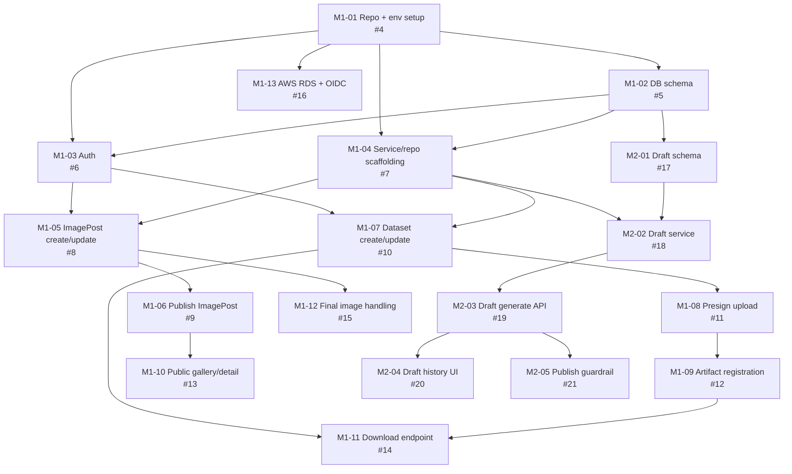

# Task DAG (M1 + M2)

This DAG shows dependencies between issues. Each node links to the issue.

```mermaid
graph TD
  %% M1
  M1_01["M1-01 Repo + env setup\n#4"]
  M1_02["M1-02 DB schema\n#5"]
  M1_03["M1-03 Auth\n#6"]
  M1_04["M1-04 Service/repo scaffolding\n#7"]
  M1_05["M1-05 ImagePost create/update\n#8"]
  M1_06["M1-06 Publish ImagePost\n#9"]
  M1_07["M1-07 Dataset create/update\n#10"]
  M1_08["M1-08 Presign upload\n#11"]
  M1_09["M1-09 Artifact registration\n#12"]
  M1_10["M1-10 Public gallery/detail\n#13"]
  M1_11["M1-11 Download endpoint\n#14"]
  M1_12["M1-12 Final image handling\n#15"]
  M1_13["M1-13 AWS RDS + OIDC\n#16"]

  %% M2
  M2_01["M2-01 Draft schema\n#17"]
  M2_02["M2-02 Draft service\n#18"]
  M2_03["M2-03 Draft generate API\n#19"]
  M2_04["M2-04 Draft history UI\n#20"]
  M2_05["M2-05 Publish guardrail\n#21"]

  %% Dependencies
  M1_01 --> M1_02
  M1_01 --> M1_03
  M1_02 --> M1_03
  M1_01 --> M1_04
  M1_02 --> M1_04

  M1_03 --> M1_05
  M1_04 --> M1_05
  M1_05 --> M1_06

  M1_03 --> M1_07
  M1_04 --> M1_07
  M1_07 --> M1_08
  M1_08 --> M1_09
  M1_07 --> M1_11
  M1_09 --> M1_11

  M1_06 --> M1_10
  M1_05 --> M1_12

  %% Infra can proceed after repo setup
  M1_01 --> M1_13

  %% M2 dependencies
  M1_02 --> M2_01
  M1_04 --> M2_02
  M2_01 --> M2_02
  M2_02 --> M2_03
  M2_03 --> M2_04
  M2_03 --> M2_05

  %% Clickable links
  click M1_01 "https://github.com/deweyjose/lumigraph/issues/4"
  click M1_02 "https://github.com/deweyjose/lumigraph/issues/5"
  click M1_03 "https://github.com/deweyjose/lumigraph/issues/6"
  click M1_04 "https://github.com/deweyjose/lumigraph/issues/7"
  click M1_05 "https://github.com/deweyjose/lumigraph/issues/8"
  click M1_06 "https://github.com/deweyjose/lumigraph/issues/9"
  click M1_07 "https://github.com/deweyjose/lumigraph/issues/10"
  click M1_08 "https://github.com/deweyjose/lumigraph/issues/11"
  click M1_09 "https://github.com/deweyjose/lumigraph/issues/12"
  click M1_10 "https://github.com/deweyjose/lumigraph/issues/13"
  click M1_11 "https://github.com/deweyjose/lumigraph/issues/14"
  click M1_12 "https://github.com/deweyjose/lumigraph/issues/15"
  click M1_13 "https://github.com/deweyjose/lumigraph/issues/16"
  click M2_01 "https://github.com/deweyjose/lumigraph/issues/17"
  click M2_02 "https://github.com/deweyjose/lumigraph/issues/18"
  click M2_03 "https://github.com/deweyjose/lumigraph/issues/19"
  click M2_04 "https://github.com/deweyjose/lumigraph/issues/20"
  click M2_05 "https://github.com/deweyjose/lumigraph/issues/21"
```
